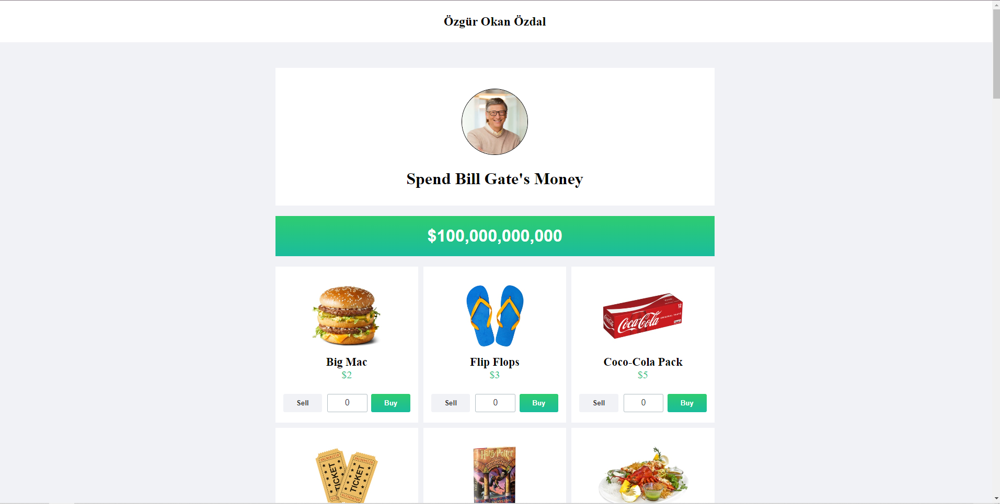

## Bill Gates Money

##### Bu proje [Patika](https://www.patika.dev/tr)'in React Patikası kapsamında yaptığım redux ödevidir.

### Gereksinimler

- Başlangıçta $100,000,000,000 bakiye tanımı yapılmalı.
- Herhangi üründen satın alma gerçekleştiğinde Gates'in bakiyesi azalmalıdır.
- Herhangi ürün satıldığında Gates'in bakiyesi artmalıdır.
- Bir üründen hiçbir tane alınmamışsa "Sell" butonu aktif olmamalıdır.
- Herhangi ürünün fiyatı, bakiyeden yüksek ise "Buy" butonu aktif olmamalıdır.
- Satın alınan ürünler ekranın en altında adetleri ve toplam bedelleri ile birlikte listelenmelidir.

#### Proje demosuna [buradan](https://kaleidoscopic-cranachan-6b5e88.netlify.app/) ulaşabilirsiniz.

#### Projenin aslına [buradan](https://neal.fun/spend/) ulaşabilirsiniz.

#### Proje Ekran Görüntüsü

